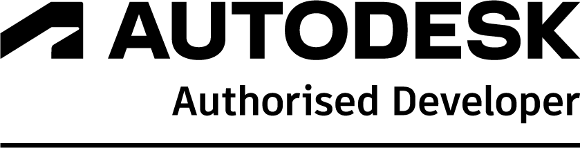
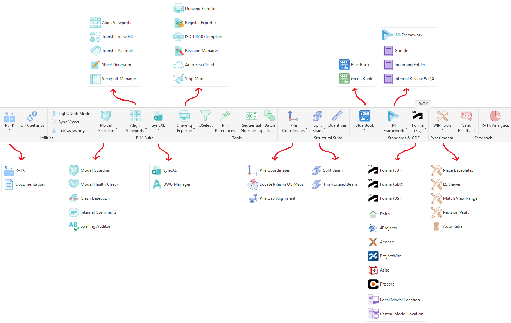
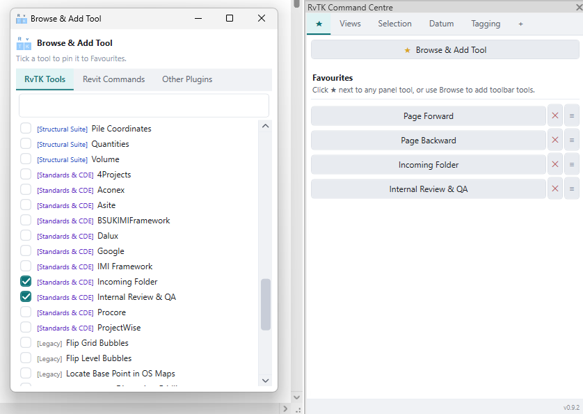

<p align="right">
  <picture>
    <source media="(prefers-color-scheme: dark)" srcset="images/autodesk-authorised-developer-logo-rgb-white.png">
    <source media="(prefers-color-scheme: light)" srcset="images/autodesk-authorised-developer-logo-rgb-black.png">
    
  </picture>
</p>

<h1>
  RvTK
</h1>

<p><strong>A BIM Management & Productivity Toolkit for Autodesk Revit</strong></p>


A C# Autodesk Revit add-in focused on BIM management, quality assurance, and productivity. Developed by BIM Managers, for BIM Managers.

---


> RvTK is an independent third-party add-in for Autodesk Revit — not affiliated with, endorsed by, or sponsored by Autodesk. "RvTK" is a working name and may change before commercial release.
>
> RvTK is in active development and beta testing. Verify automated outputs through your normal project QA process before relying on results for project delivery.

---

## Table of Contents

- [Quick Start](#quick-start)
- [Overview](#overview)
- [Development Team](#development-team)
- [Target Users](#target-users)
- [Autodesk API Integration](#autodesk-api-integration)
- [Technology Stack](#technology-stack)
- [Compatibility](#compatibility)
- [Requirements](#requirements)
- [Screenshots](#screenshots)
- [RvTK Command Centre](#rvtk-command-centre)
- [Installation & Updates](#installation--updates)
- [BIM Manager Deployment](#bim-manager-deployment)
- [Beta Testing & Feedback](#beta-testing--feedback)
- [Development Roadmap](#development-roadmap)
- [Licensing & Commercial Release](#licensing--commercial-release)
- [Contact](#contact)

---

## Quick Start

New to RvTK? Head to [Installation & Updates](#installation--updates) for step-by-step install instructions, including fixes if Windows Defender or company policy blocks the installer. See [Beta Testing & Feedback](#beta-testing--feedback) for how to report issues.

---

## Overview

Every undetected modelling error, missed BIM standard, and manual quality assurance check costs time, money, and confidence in project delivery. Repetitive tasks slow teams down, but the greatest cost to most organisations is human error and the rework that follows.

RvTK is a professional Autodesk Revit add-in built to reduce that risk. It brings quality assurance, BIM standards enforcement, workflow automation, and productivity tools together into a single platform, helping teams catch issues before they become costly problems.

By automating repetitive validation and checking tasks, RvTK reduces reliance on manual QA, improves model consistency, and increases confidence in project deliverables — fewer errors, less rework, and more predictable outcomes.

Beyond quality assurance, RvTK streamlines everyday Revit workflows by automating repetitive tasks and removing unnecessary manual steps, so teams can spend more time designing and delivering projects and less time administering models.

The aim is a single, unified toolkit — replacing the need for five or more separate add-ins with one consistent platform. The exception is ultra-specialised tools, which can be added as extensions and called upon directly from the [RvTK Command Centre](#rvtk-command-centre), keeping everything accessible from one place.

---

## Development Team

RvTK is developed by a two-person team with over three decades of combined experience across structural engineering, BIM management, and Autodesk Revit project delivery. It's built from real-world experience solving practical workflow challenges, and is currently being validated with external Revit users ahead of commercial release.

---

## Target Users

RvTK is designed for organisations and professionals using Autodesk Revit who want to improve project quality, reduce manual effort, and standardise BIM delivery, including:

- BIM Managers
- Structural Engineering Teams
- Architectural Practices
- MEP Teams
- Design Consultancies

RvTK's roadmap extends this support to further disciplines across the AEC industry over time.

---

## Autodesk API Integration

RvTK is built directly on the Autodesk Revit API, allowing it to analyse, validate, and manage Revit data in real time, including:

- Quality assurance and model validation
- BIM standards enforcement
- Parameter management
- Drawing production
- Workflow automation
- Custom productivity tools

---

## Technology Stack

- C#
- Autodesk Revit API
- .NET Framework
- Windows Presentation Foundation (WPF) for custom user interfaces

Follows standard Revit API development practices, including transaction-based workflows and Revit's single-threaded application architecture.

---

## Compatibility

| Revit Version | Support Status |
|---|---|
| 2023 | ✅ Supported |
| 2024 | ✅ Supported |
| 2025 | ✅ Supported |
| 2026 | ✅ Supported |
| 2027 | ⚠️ Limited testing |

---

## Requirements

- Windows 10/11
- Autodesk Revit 2023 or newer
- .NET Framework 4.8 or later
- A valid Autodesk Revit installation

---

## Screenshots

**RvTK Ribbon** — custom ribbon tab providing access to all RvTK tools and panels.



**RvTK Command Centre** — centralised, customisable workspace for favourite tools and commands.



---

## RvTK Command Centre

The Command Centre provides a centralised location for accessing and organising everyday Revit workflows.

The customisable **Favourites Panel** lets users build a personalised workspace by adding:

- RvTK tools
- Native Revit commands
- Commands from other Revit add-ins and plugins

This gives a single access point for the tools users rely on most, reducing the need to navigate multiple ribbon tabs and interfaces.

---

## Installation & Updates

### Installation

1. Download the latest RvTK release package.
2. Extract the downloaded ZIP file.
3. Ensure Autodesk Revit is closed.
4. Run the RvTK installer (`.exe`).
5. Open Revit — RvTK will be available.

No additional configuration is required for a standard installation. Administrator permissions may be required depending on your organisation's security settings.

#### If installation is blocked (Windows Defender / company policy)

If the installer is blocked or fails silently, this is usually Windows Defender (SmartScreen) or company IT policy flagging a file downloaded directly from a browser. Try the following, in order:

1. **Move the ZIP before extracting.** Don't run the installer straight from `Downloads`. Move the ZIP file to `Documents` (or another local, non-`Downloads` folder) first, *then* extract it there.
2. **Extract before running.** Always fully extract the ZIP before running the installer — running an `.exe` directly from inside a zipped archive is more likely to be blocked.
3. **Unblock the file manually.** Right-click the extracted `.exe` → **Properties** → if there's an **Unblock** checkbox near the bottom of the General tab, tick it → **Apply**.
4. **Check Windows Defender / SmartScreen prompts.** If a blue "Windows protected your PC" screen appears, click **More info**, then **Run anyway** (this option only appears for locally unblocked files, not ones still in `Downloads`).
5. **Reboot after extraction.** On managed/corporate machines, a reboot can be required for changes to file permissions or newly whitelisted paths to take effect before the installer will run.
6. **Check with IT if the block persists.** On company-managed devices, Group Policy or an endpoint protection tool (e.g. SentinelOne, CrowdStrike) may block unsigned or unrecognised installers outright — a local workaround won't help here, and the file/publisher may need to be allow-listed by IT.

If none of the above resolves it, contact us via the [feedback button](#beta-testing--feedback) or [email](#contact) with a screenshot of the exact block message.

### Updating RvTK

1. Download the latest RvTK release package.
2. Close Autodesk Revit.
3. Extract the new ZIP file.
4. Run the updated RvTK installer (`.exe`).

The latest version replaces the previous installation while retaining existing configuration settings.

### Uninstalling RvTK

The uninstaller is located at:

```
%appdata%\RvTK\RvTK uninstaller\uninstaller.exe
```

It provides three options:

| Option | Effect |
|---|---|
| **Remove Plugin Only** | Removes add-in files, keeps user configuration |
| **Clear Personal Configuration** | Removes settings/preferences, keeps installation |
| **Complete Clean Uninstall** | Removes everything — files, config, preferences |

Restart Autodesk Revit after uninstalling to ensure all components are fully removed.

---

## BIM Manager Deployment

RvTK includes organisation-level configuration tools for BIM Managers to manage, customise, and centrally distribute workflows across project teams.

### Deployment Workflow

1. Configure RvTK Settings on the designated BIM Manager machine.
2. Export the RvTK configuration package.
3. Distribute the package to the required users or machines.
4. Import the configuration package on each machine.

This helps organisations maintain consistent RvTK settings across teams, standardise workflows, and support company BIM standards. Further deployment and management features are in ongoing development.

---

## Beta Testing & Feedback

RvTK installations currently include a **35-day evaluation period**, renewed with every fresh installation while in development, so testers can continue reviewing improvements and providing feedback.

Feedback, bug reports, and feature suggestions are encouraged via the **inbuilt feedback button within RvTK**, or through the contact details [below](#contact) — including workflow challenges, repetitive tasks worth automating, and tool suggestions.

---

## Development Roadmap

RvTK has progressed from BIM automation tools into a wider Revit productivity platform focused on everyday AEC workflows.

### Completed

- [x] C# Revit add-in framework
- [x] Autodesk Revit API integration
- [x] Multi-version Revit support (2023–2026, initial 2027 testing)
- [x] Custom ribbon interface
- [x] RvTK Command Centre
- [x] Custom WPF UI framework
- [x] BIM Manager configuration and deployment workflows
- [x] Core BIM management, QA, productivity, and automation tools
- [x] Initial internal testing across real-world Revit workflows

### Current Phase — External Beta Testing & Development

- [ ] Rolling out RvTK to selected external testers
- [ ] Gathering feedback from BIM professionals
- [ ] Improving stability, performance, and usability
- [ ] Prioritising future development based on real-world workflows
- [ ] Broadening feedback from structural, architectural, MEP, and other disciplines

### Next Steps

- [ ] Continue external beta testing
- [ ] Grow BIM management and productivity workflows
- [ ] Develop specialised tools for architectural, MEP, structural, and other AEC disciplines
- [ ] Enhance organisation-wide deployment and configuration management
- [ ] Deepen QA and BIM standards workflows
- [ ] Continue compatibility testing across future Revit releases
- [ ] Prepare RvTK for commercial release

---

## Licensing & Commercial Release

RvTK is free during the development and beta testing phase, distributed under a beta evaluation model (see [Beta Testing & Feedback](#beta-testing--feedback)) rather than a standard open-source license — terms of use are provided with the installer.

As RvTK progresses towards commercial release, users will get advance notice of licensing changes, pricing, and availability. Pricing will be kept affordable, with the aim that the value returned — hourly rate saved × time saved — vastly outweighs the cost. Testers who contribute meaningful feedback, workflow suggestions, or testing may also be eligible for preferential pricing at launch.

### Requesting Bespoke Tools

Have a specific workflow problem RvTK doesn't solve yet? Get in touch — during the development period, bespoke tools built from user requests are likely to be provided free of charge and made available to all RvTK users, at our discretion. This is one of the best ways to directly shape the toolkit, so don't hesitate to [reach out](#contact).

---

## Contact

For feedback, suggestions, beta testing enquiries, or further information:

**info@rvtk.co.uk**

We welcome feedback from BIM professionals and organisations looking to reduce project risk, improve quality assurance, automate Revit workflows, and help shape the future of RvTK.
