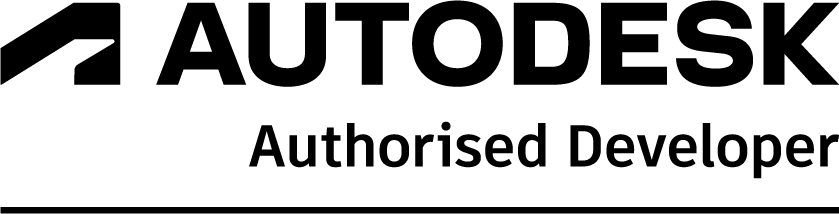

  <picture>
    <source media="(prefers-color-scheme: dark)" srcset="images/autodesk-authorised-developer-logo-rgb-white.png">
    <source media="(prefers-color-scheme: light)" srcset="images/autodesk-authorised-developer-logo-rgb-black.png">
    
  </picture>

<h1>
  RvTK
</h1>

<strong>A Civil 3D & Revit Engineering Productivity and Automation Toolkit</strong>

A C# Autodesk development platform focused on engineering automation, BIM, design workflows, quality assurance, and productivity across Civil 3D and Revit. Developed by engineers and BIM professionals, for engineers and BIM professionals.

⸻

RvTK is an independent third-party toolkit for Autodesk Civil 3D and Revit — not affiliated with, endorsed by, or sponsored by Autodesk. “RvTK” is a working name and may change before commercial release.

RvTK is in active development and beta testing. Verify automated outputs through your normal project QA process before relying on results for project delivery.

⸻

Table of Contents

* Quick Start
* Overview
* Development Team
* Target Users
* Autodesk API Integration
* Technology Stack
* Compatibility
* Requirements
* Screenshots
* RvTK Command Centre
* Installation & Updates
* BIM & CAD Manager Deployment
* Beta Testing & Feedback
* Development Roadmap
* Licensing & Commercial Release
* Contact

⸻

Quick Start

New to RvTK?

RvTK is being developed as a unified engineering productivity platform for Autodesk Civil 3D and Revit, bringing custom automation, engineering tools, QA workflows, and productivity features into a consistent environment.

Head to Installation & Updates for installation instructions.

See Beta Testing & Feedback for how to report issues, suggest features, or request new engineering workflows.

⸻

Overview

Engineering teams spend significant time performing repetitive CAD and BIM tasks that are necessary for project delivery but add limited engineering value.

Creating and editing Civil 3D objects, checking design data, managing model information, producing drawings, transferring information between platforms, and maintaining consistent standards can all involve substantial amounts of manual work.

RvTK aims to reduce that overhead.

RvTK is a professional Autodesk productivity and automation toolkit being developed around two core platforms:

* Autodesk Civil 3D — engineering design, infrastructure modelling, CAD automation, data management, and computational workflows.
* Autodesk Revit — BIM, structural modelling, model management, QA, information management, and design automation.

The goal is to provide engineers with tools that automate repetitive tasks, improve consistency, reduce errors, and make complex workflows easier to execute.

One toolkit across the engineering workflow

Civil 3D and Revit are powerful platforms individually, but engineering workflows frequently span multiple applications and disciplines.

RvTK is intended to provide a common development and productivity layer across these environments.

This includes:

* Civil 3D automation
* Revit automation
* Engineering calculations and computational workflows
* Model and data validation
* BIM and CAD standards
* Drawing production
* Parameter and property management
* Object creation and manipulation
* Data extraction and reporting
* Interoperability workflows
* Repetitive task automation
* Custom engineering tools

The long-term aim is to reduce the requirement for multiple small, disconnected tools and provide a single consistent RvTK Command Centre from which users can access the workflows they use most.

Highly specialised third-party tools can also be incorporated as extensions or external commands where appropriate.

⸻

Development Team

RvTK is developed by a two-person team with over three decades of combined experience across structural engineering, BIM management, CAD, computational engineering, and Autodesk project delivery.

The toolkit is being developed around practical engineering problems encountered during real project work rather than purely theoretical automation use cases.

This means the focus is on tools that provide tangible improvements to engineering workflows:

less repetition → fewer errors → faster delivery → better-quality information.

RvTK is currently being validated through real-world workflows and external beta testing ahead of potential commercial release.

⸻

Target Users

RvTK is designed primarily for engineering organisations and professionals using Autodesk Civil 3D and Revit, including:

* Civil Engineers
* Structural Engineers
* Infrastructure Engineers
* BIM Managers
* CAD Managers
* Computational Engineers
* Digital Engineering Teams
* Design Consultancies
* Civil & Structural Engineering Practices
* Infrastructure Contractors

The toolkit is intended to support both individual engineers and organisation-wide workflows.

⸻

Autodesk API Integration

RvTK is built around Autodesk’s native development APIs, allowing tools to interact directly with Civil 3D and Revit data rather than relying solely on external file manipulation.

Civil 3D

Civil 3D functionality is developed around the:

* Autodesk Civil 3D .NET API
* AutoCAD .NET API
* Civil 3D objects and styles
* Alignments
* Profiles
* Corridors
* Surfaces
* Feature lines
* Pipe networks
* Pressure networks
* Parcels
* Sites
* COGO points
* Data shortcuts
* Drawing and object data

Potential applications include:

* Civil 3D automation
* Engineering design workflows
* Object creation and manipulation
* Model interrogation
* QA and validation
* Drawing production
* Data extraction
* Standards checking
* Computational engineering workflows
* Repetitive task automation

Revit

Revit functionality is developed around the Autodesk Revit API, supporting:

* BIM quality assurance
* Model validation
* BIM standards enforcement
* Parameter management
* Element interrogation
* Drawing production
* Model automation
* Data extraction
* Workflow automation

The long-term objective is to develop workflows that can operate across both Civil 3D and Revit where engineering projects require information to move between the two environments.

⸻

Technology Stack

* C#
* .NET
* Autodesk Civil 3D .NET API
* Autodesk AutoCAD .NET API
* Autodesk Revit API
* Windows Presentation Foundation (WPF)
* Autodesk desktop application platforms

RvTK follows Autodesk’s standard API development practices, including transaction-based workflows, document locking where required, and platform-specific application architecture.

⸻

Compatibility

Civil 3D

Civil 3D version compatibility is under active development and testing.

Platform	Support Status
Civil 3D	✅ Active development
AutoCAD	✅ Supporting platform
Revit	✅ Active development

Civil 3D version support will be documented against individual RvTK releases as the Civil 3D toolset matures.

Revit

Revit Version	Support Status
2022	✅ Supported
2023	✅ Supported
2024	✅ Supported
2025	✅ Supported
2026	✅ Supported
2027	⚠️ Limited testing

⸻

Requirements

Civil 3D

* Windows 10/11
* Autodesk Civil 3D installation
* Compatible Autodesk desktop/API components
* .NET runtime/framework requirements applicable to the RvTK release

Revit

* Windows 10/11
* Autodesk Revit 2022 or newer
* .NET Framework 4.8 or applicable runtime requirements
* A valid Autodesk Revit installation

Specific version requirements will be provided with each RvTK release.

⸻

Screenshots

RvTK Ribbon — custom ribbon interface providing access to RvTK tools and engineering workflows.

RvTK Command Centre — centralised workspace for accessing RvTK tools, native Autodesk commands, and other installed workflows.

Additional Civil 3D-specific interface and workflow screenshots will be added as the Civil 3D toolset develops.

⸻

RvTK Command Centre

The RvTK Command Centre provides a centralised location for accessing and organising engineering workflows across Autodesk applications.

The customisable Favourites Panel is intended to provide a single productivity workspace where users can access:

* RvTK tools
* Civil 3D commands
* Revit commands
* Native Autodesk commands
* Commands from other installed add-ins
* Frequently used engineering workflows

The objective is simple:

One place to access the tools you use every day.

Rather than navigating between multiple ribbon tabs, applications, and add-ins, users can build a personalised engineering workspace around their own workflows.

⸻

Installation & Updates

Installation

1. Navigate to the latest RvTK release on GitHub Releases.
2. Download the RvTK installer (.exe) from the release assets.
3. Ensure Autodesk applications are closed.
4. Run the RvTK installer.
5. Open Civil 3D or Revit.
6. RvTK will load into the supported Autodesk application(s).

No additional configuration is required for a standard installation.

Administrator permissions may be required depending on organisational security policies.

If installation is blocked

If the installer is blocked or fails silently, this is usually Windows Defender, SmartScreen, or company IT policy flagging a file downloaded directly from a browser.

Try the following:

1. Move the downloaded ZIP from Downloads to Documents or another local folder.
2. Fully extract the ZIP before running the installer.
3. Right-click the extracted .exe → Properties → tick Unblock if available → Apply.
4. If Windows SmartScreen appears, select More info → Run anyway, where permitted.
5. Restart the computer if required by your organisation’s security configuration.
6. Contact IT if endpoint protection or Group Policy continues to block the installer.

On managed corporate machines, unsigned or unrecognised installers may require the RvTK installer or publisher to be allow-listed by IT.

Updating RvTK

RvTK checks for new versions automatically and will notify users when an update is available.

Selecting Download from the update notification downloads and launches the installer.

Alternatively:

1. Download the latest RvTK release package from GitHub Releases.
2. Close Autodesk Civil 3D and Revit.
3. Extract the new package.
4. Run the updated RvTK installer.

The latest version replaces the previous installation while retaining existing configuration where supported.

Uninstalling RvTK

The uninstaller is located at:

%appdata%\RvTK\RvTK uninstaller\uninstaller.exe

It provides three options:

Option	Effect
Remove Plugin Only	Removes RvTK files while retaining user configuration
Clear Personal Configuration	Removes settings and preferences
Complete Clean Uninstall	Removes RvTK files, configuration, and preferences

Restart Autodesk applications after uninstalling to ensure all components are fully removed.

⸻

BIM & CAD Manager Deployment

RvTK includes organisation-level configuration capabilities intended to help BIM Managers, CAD Managers, and Digital Engineering teams standardise workflows across project teams.

Deployment Workflow

1. Configure RvTK settings on the designated management machine.
2. Export the RvTK configuration package.
3. Distribute the package to required users or machines.
4. Import the configuration package.

This allows organisations to establish consistent:

* Tool configurations
* Engineering workflows
* Standards
* User preferences
* QA processes
* Command Centre configurations

Further organisation-wide deployment and management features are in development.

⸻

Beta Testing & Feedback

RvTK installations currently include a 35-day evaluation period, renewed with every fresh installation while the software remains in development.

Feedback, bug reports, workflow suggestions, and engineering automation requests are strongly encouraged.

Useful feedback includes:

* Repetitive Civil 3D tasks
* Repetitive Revit tasks
* CAD/BIM standards issues
* QA checks
* Engineering calculations
* Data extraction requirements
* Drawing production workflows
* Interoperability problems
* Tasks currently handled through spreadsheets or manual processes
* Existing add-ins that could potentially be replaced or consolidated

Feedback can be submitted through the inbuilt RvTK feedback button or via the contact details below.

⸻

Development Roadmap

RvTK is evolving from a Revit-focused BIM toolkit into a broader Civil 3D and Revit engineering automation platform.

Completed

* [x]	C# Autodesk development framework
* [x]	Autodesk Revit API integration
* [x]	Multi-version Revit support
* [x]	Custom ribbon interface
* [x]	RvTK Command Centre
* [x]	Custom WPF UI framework
* [x]	BIM Manager configuration and deployment workflows
* [x]	Core Revit BIM management tools
* [x]	Revit QA and productivity workflows
* [x]	Initial real-world engineering workflow testing

Current Phase — Civil 3D Expansion & External Beta Testing

* [ ]	Expand Civil 3D API integration
* [ ]	Develop Civil 3D engineering productivity tools
* [ ]	Develop Civil 3D QA and standards workflows
* [ ]	Extend RvTK Command Centre into Civil 3D
* [ ]	Gather feedback from Civil 3D users
* [ ]	Continue external Revit beta testing
* [ ]	Improve stability, performance, and usability
* [ ]	Identify high-value repetitive engineering workflows for automation

Engineering Automation

* [ ]	Automated Civil 3D object creation and manipulation
* [ ]	Engineering design automation
* [ ]	Civil 3D model interrogation and QA
* [ ]	Automated drawing production
* [ ]	Data extraction and reporting
* [ ]	Computational engineering workflows
* [ ]	Engineering calculation tools
* [ ]	Parametric and rule-based workflows
* [ ]	Automated standards checking
* [ ]	Cross-platform Civil 3D ↔ Revit workflows

Future Development

* [ ]	Expand Civil 3D and Revit interoperability
* [ ]	Develop organisation-wide standards management
* [ ]	Extend CAD/BIM Manager deployment capabilities
* [ ]	Develop discipline-specific engineering toolsets
* [ ]	Support additional Autodesk workflows where appropriate
* [ ]	Continue compatibility across future Autodesk releases
* [ ]	Prepare RvTK for commercial release

⸻

Licensing & Commercial Release

RvTK is currently free to download and use under a beta evaluation model rather than a standard open-source licence. Terms of use are provided with the installer.

The long-term licensing model has not yet been finalised.

The most likely direction is a paid model to support continued development, although RvTK may remain free indefinitely. No final decision or timeline has been established.

If a paid model is introduced, existing users will receive advance notice before any changes take effect.

Testers who provide meaningful feedback during development may also receive preferential pricing or other benefits at commercial launch.

Requesting Bespoke Tools

Have a Civil 3D, Revit, CAD, BIM, or engineering workflow that RvTK doesn’t currently solve?

Get in touch.

During the development period, bespoke tools arising from user requests may be developed free of charge and potentially incorporated into RvTK for wider use, at the development team’s discretion.

This provides users with an opportunity to directly influence the development roadmap around genuine engineering problems.

⸻

Contact

For feedback, suggestions, beta testing enquiries, engineering automation requests, or further information:

info@rvtk.co.uk

RvTK welcomes feedback from engineers, BIM Managers, CAD Managers, computational engineers, and organisations looking to:

* Automate repetitive engineering tasks
* Improve Civil 3D and Revit workflows
* Reduce manual QA
* Improve design consistency
* Reduce project risk
* Connect engineering data
* Improve productivity
* Develop better digital engineering workflows

RvTK — engineering automation for Civil 3D and Revit.